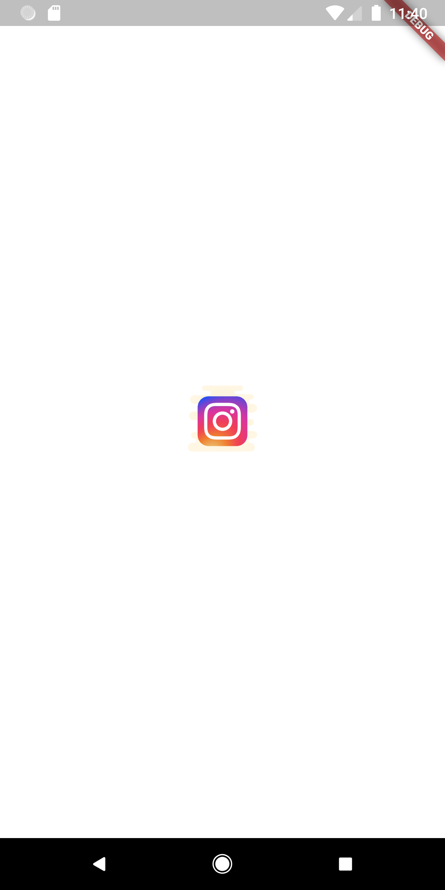
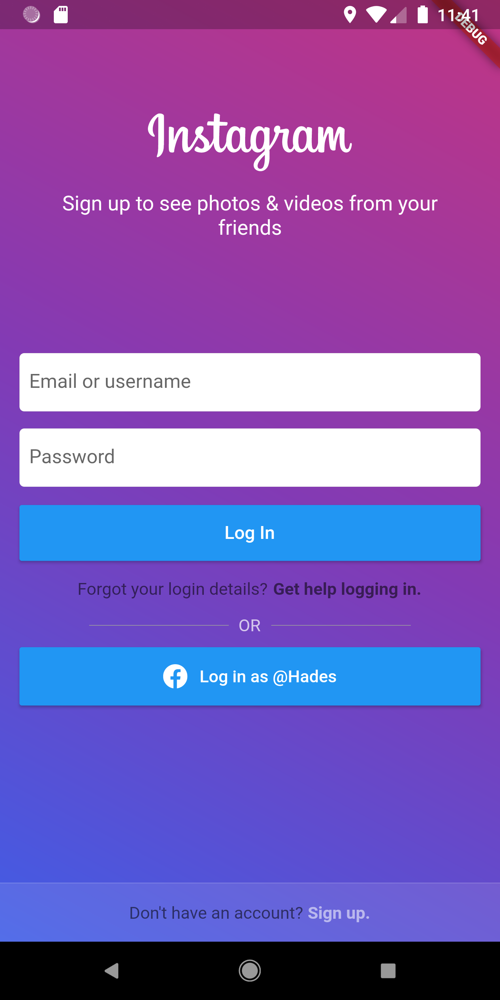
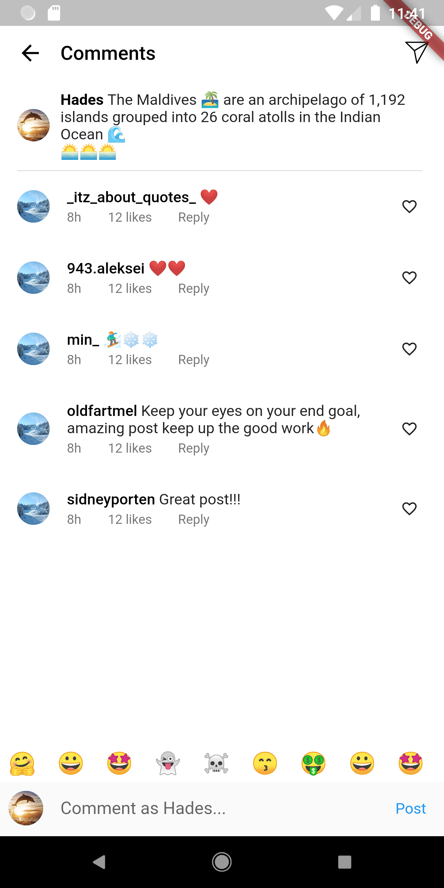
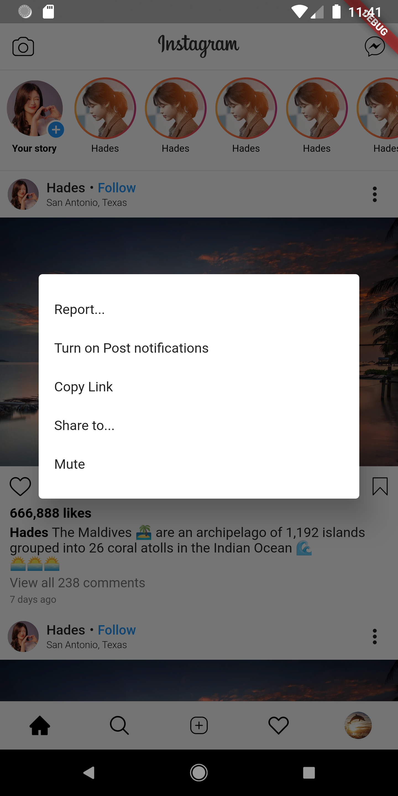
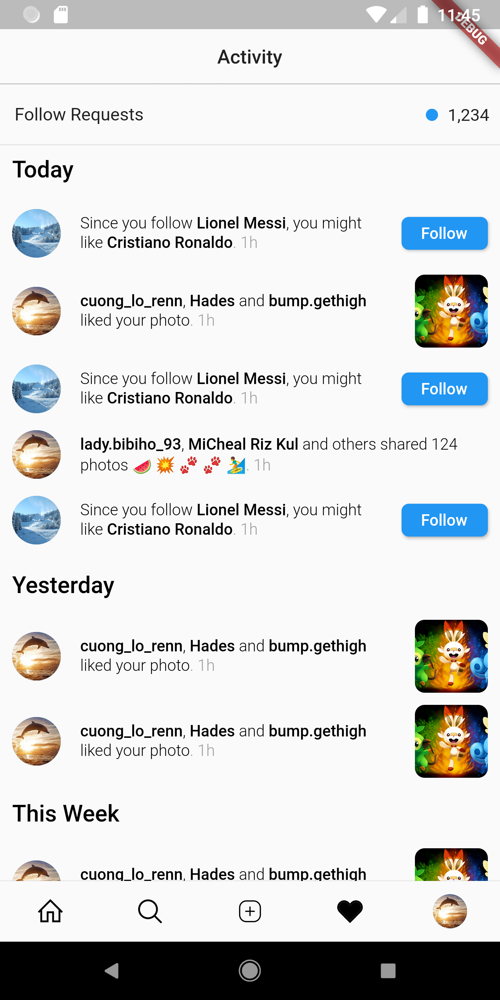
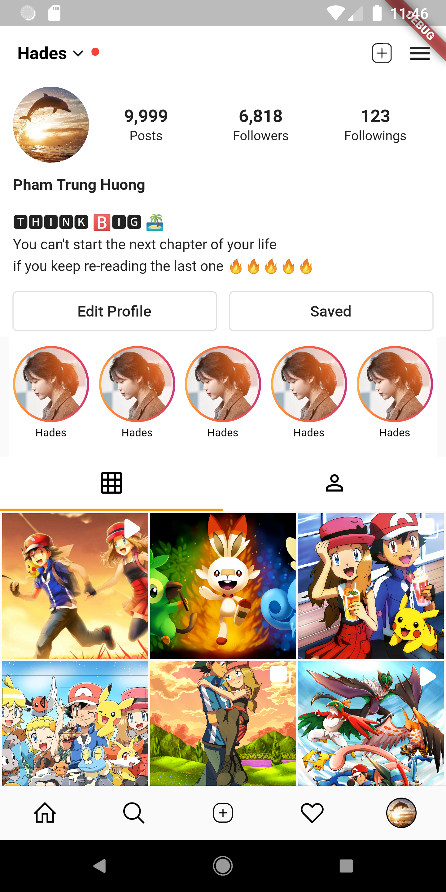
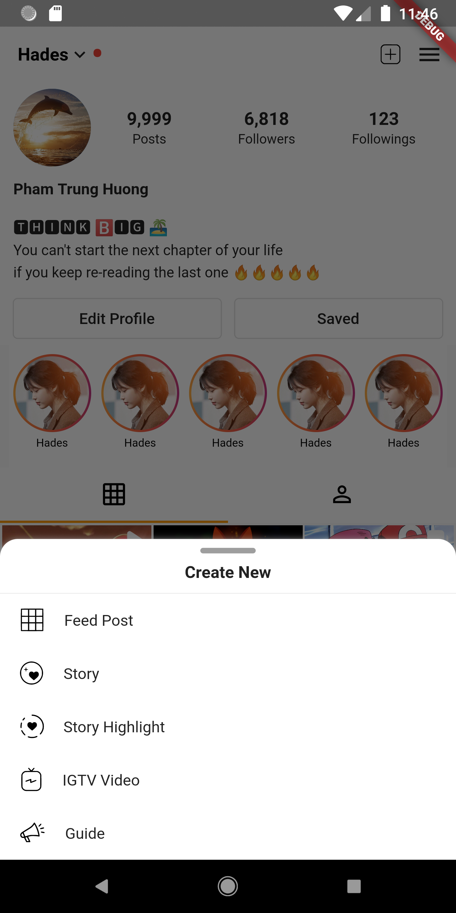
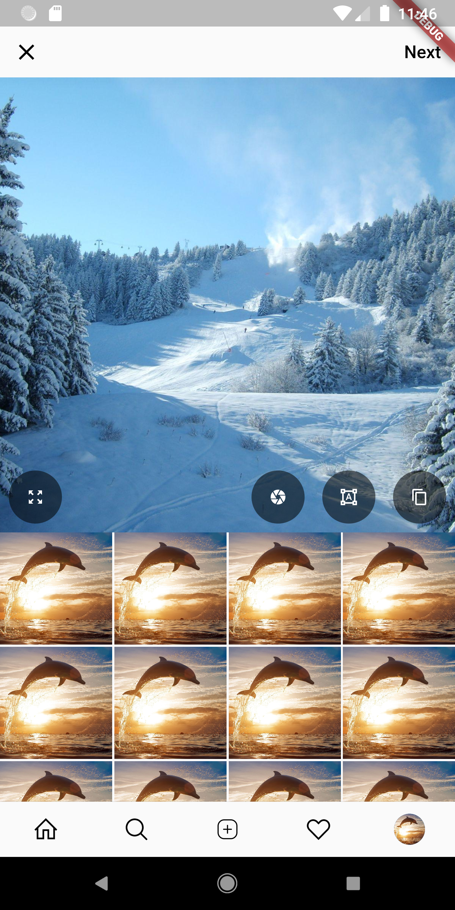
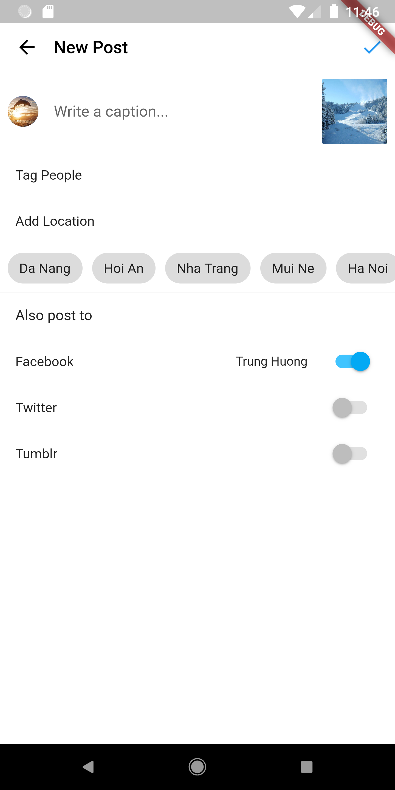

# Instagram Flutter

A new Flutter project 🔥🔥🔥

## Getting Started

This project is a starting point for a Flutter application.

A few resources to get you started if this is your first Flutter project:

- [Lab: Write your first Flutter app](https://flutter.dev/docs/get-started/codelab)
- [Cookbook: Useful Flutter samples](https://flutter.dev/docs/cookbook)

| | |
|:----|:----|
|||
|||
|||
|||
|||
|||