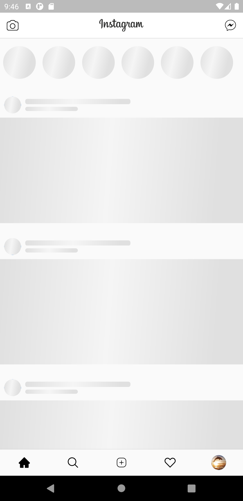
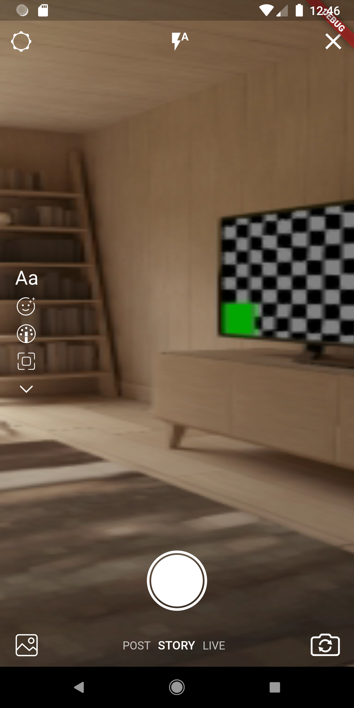

# Instagram Flutter

Build an Instagram clone project with similar functions 🔥🔥🔥

FE: [Flutter]() 
Backend: [Express NodeJS](https://nodejs.org/en/docs/) 
Database: [MongoDB](https://www.npmjs.com/package/mongoose) + [Firebase](https://firebase.google.com/docs/firestore)

Give a ⭐⭐⭐　if you like this 🔥

## Features
 - [x] SignIn / SignUp
 - [x] Read NewsFeed
 - [x] Create Posts
 - [ ] Like/Comment/Follow
 - [ ] Stories
 - [ ] Explore
 - [ ] Activities
 - [x] Profile
 - [ ] Notification
 - [ ] Direct message
 
## Screenshots

|                                                                 |                                         |                                         |
| :-------------------------------------------------------------- | :-------------------------------------- | :-------------------------------------- |
|  |  |  |
|                          |  |  |
|                          |  |  |
|                          |  |  |
|                          |  |

## Contributing

Contributions, issues and feature requests are welcome!

Feel free to check the [issues page](../../issues).